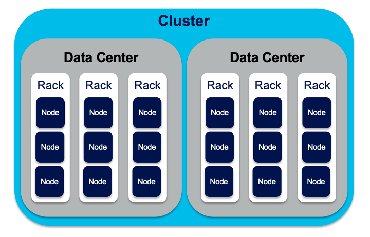

# Apache Cassandra

Apache Cassandra is a **distributed, highly available, NoSQL database** designed for:

- Massive data volumes
- High write throughput
- No single point of failure
- Horizontal scalability

It follows a **peer-to-peer architecture** (no master node).

## Core Cassandra Concepts

### Node

- A **single Cassandra instance**
- In Docker → one container = one node

### Cluster

- A **group of nodes** working together
- All nodes are equal (no master/slave)

### Data Center (DC)

- Logical grouping of nodes
- Even on one machine, Docker nodes are often placed in `dc1`

### Rack

- Sub-division inside a DC
- Used for fault tolerance
- In Docker lab → usually `rack1`

[Cassandra Architecture](Cassandra%20Architecture.md)

[Replication in Cassandra](Replication%20in%20Cassandra.md)

[Tunable Consistency](Tunable%20Consistency.md)