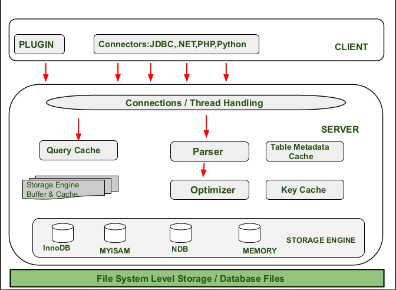

# MySQL Architecture

**MySQL database management system** has a three-tier architecture , which consists of the **client**, **server**, and **storage engine** layers. The **client layer** handles essential tasks such as **connection management**, **user authentication**, and **security permissions** for various programming interfaces. Within the **server layer**, the system utilizes **query caching** to speed up results, while a **parser** and **optimizer** work together to validate syntax and determine the most efficient execution path. This layer functions as the **brain of the system**, using **multithreading** to manage requests from several users simultaneously. Finally, the **storage engine layer** is responsible for the actual **physical storage** and retrieval of data across different table types.

[CLIENT LAYER (Top Section)](client_layer.md)

[SERVER LAYER (Core Processing Layer)](server_layer.md)

[STORAGE ENGINE LAYER](storage_engine_layer.md)