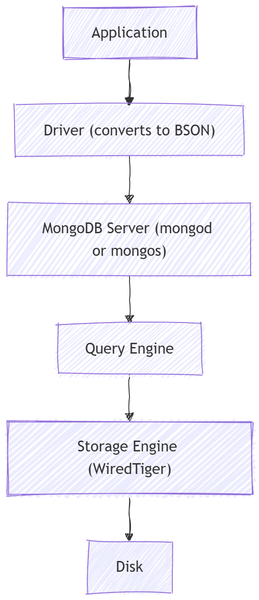

# Architecture

This is the simplified architecture of mongoDB.We will go deeper step by step.
We can devide this work flow in some layers 

[1.Application Layer ](03%20Application%20Layer.md)

[2.Cluster Layer](04%20Cluster%20Layer.md)

[**3.Query Processing Layer**](07%20Query%20Processing%20Layer.md)

[4.Storage Engine (WiredTiger)](08%20Storage%20Engine.md)