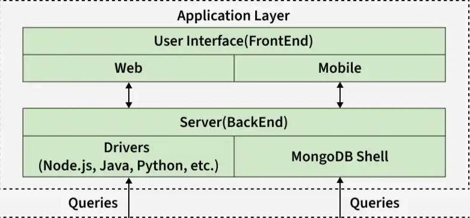

# 1.Application Layer

The **Client Layer** is where the application interacts with MongoDB.

This includes:

- Application code
- MongoDB Drivers
- Mongo Shell



## Components

### 1. Application

Your backend application: Node.js , Python, Java, Go, etc.

Example:

```jsx
db.users.insertOne({name:"Nivrita",age:23 })
```

### **2. MongoDB Drivers**

MongoDB uses **official drivers** to connect applications to the server.

Example drivers:

- Node.js Driver
- PyMongo (Python)
- Java Driver

Drivers convert:

- JSON → **BSON**
- Handle connection pooling
- Manage authentication
- Handle retries

### **3. MongoDB Shell**

Modern shell: MongoDB Shell (mongosh)

MongoDB Shell is a command-line client used to interact directly with MongoDB.

It behaves like a lightweight application and internally uses a driver to communicate with the MongoDB server.

Example:

```jsx
db.users.find()
```

When you run a command in mongosh:

1. The shell converts the command to BSON
2. Sends it over TCP (default port 27017)
3. MongoDB server processes the request

So the flow becomes:

```
User → mongosh → Network Layer → MongoDBServer
```

---

### 4. BSON Conversion

MongoDB stores data in **BSON (Binary JSON)**.

BSON is a binary-encoded serialization format used by MongoDB to store documents efficiently. It extends JSON by supporting additional data types and enabling faster data processing.

Example:

JSON:

```json
{"name":"Nivrita","age":23}
```

Converted to BSON → Sent to MongoDB Server

## Workflow —

- User/Application creates a query
- Driver (or mongosh) validates and structures the command
- Command is converted from JSON → BSON
- Driver attaches:
    - Authentication credentials
    - Session / transaction ID (if used)
    - Cluster time / metadata
- Connection pool selects or creates a TCP connection
- Request is sent to the Network Layer