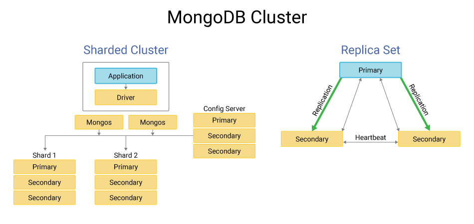

# 2.Replica Set



A MongoDB replica set is a group of `mongod` processes that provide data redundancy and high availability by maintaining the same dataset across multiple servers. The architecture is **based on a primary-secondary model and includes several components working together.**

Imagine 3 machines:

```
Server A Server B Server C
```

All three run:

```
mongod
```

All three have:

- WiredTiger
- Journal
- Cache
- Data files

But they have different roles.

There are 3 possible roles:

1. Primary
2. Secondary
3. Arbiter (optional

### How Primary Is Chosen

When replica set starts:  All nodes talk to each other.

They perform something called:

> Election
> 

Each node votes.

One node becomes:

```
PRIMARY
```

Others become:

```
SECONDARY
```

Important rule:

**Only ONE primary at a time.**

This prevents data conflict.

when someone wants to write something, Application sends write to replica set.

But writes are only allowed on:

```
PRIMARY
```

If you try writing to secondary → error.

### Oplog

The Oplog (Operation Log) is a special collection in MongoDB's primary node that records all write operations.

It has three key characteristics:

- **Capped collection** — it has a fixed size and automatically overwrites old entries when full
- **Append-only** — new operations are only added to the end
- **Ordered by time** — operations are stored chronologically

The oplog is stored in the `local.oplog.rs` collectionand is used by secondary nodes to replicate data from the primary, ensuring all nodes in the replica set stay synchronized.

Every write operation is recorded here.

### **Replication Is Asynchronous**

Primary does NOT wait by default.

Flow:

```
Primary writes
↓
Primary records oplog
↓
Returns successto client
↓
Secondariescopy later
```