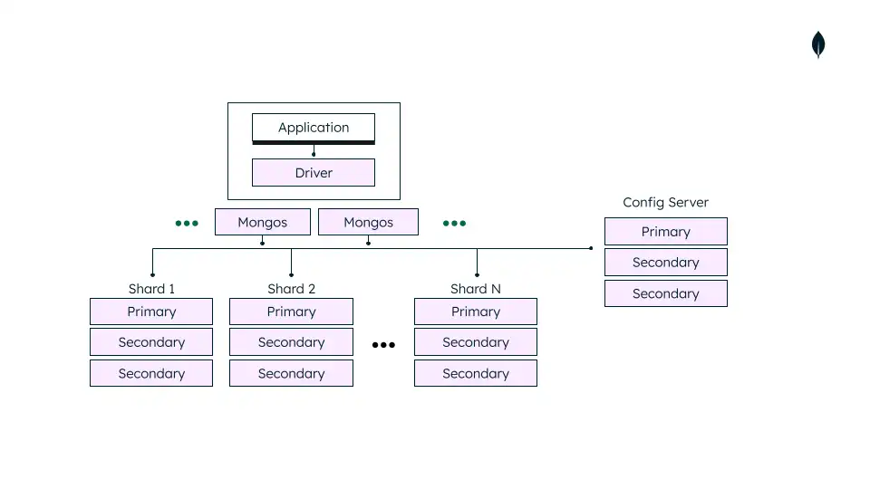

# 3.Sharded Cluster Architecture

A MongoDB sharded cluster is **an architecture for horizontal scaling that distributes large datasets and high read/write workloads across multiple servers**. It consists of three essential components: Shards, Query Routers (mongos), and Config Servers.

[MongoDB](data:image/png;base64,iVBORw0KGgoAAAANSUhEUgAAAEAAAABACAYAAACqaXHeAAAMPklEQVR4nL2b629cx3XAf2fmLrnk8rFciqRFKWSsh2lRkkVKLlokH+q2QYCiaJHEMgokQYGgDYI2BRKgf0nRD22B1v6QFi1cpU4+BEjQD3ELFKkTSFQU6mHaliBKJE0uRXJFitzl7p3TD3MvX1o+d+QDXGD3zsyZ854zZ+YKLwreeCNiYq6fyAyhehZlEPQ44noQ04lqDkcGAEMVkWeoK6GmCDKDMInIBNV4gqG+Kd5/v/YiyJTA+Az9w5fIMEpNzmP0FNCDcAznujCmHaQFERCzfaQ6UAV0DeeWMWYRZR4o4uQ+kd5mPbrJzK0xQEMRHEYAvRf6yMYXUTuCMEIcX8aYIaw1ninYoFm3/K5Hjmz5DSACcexw7kOsvYG6MUR/zZqMU7zzaaOkNyaAgYtduPgVkDdw7iqReR0RNpkODCKgTqnpdYz8EPg5xk4w+ZvFI6M8MjH9wwNEfB3lLQyfQ+UYYgR0Hy0fFbZYh6oiOo/jEcI1Iv6V+3cmj4LVHnpE32s5CoU/wtjv4LiKtecQmwPkhWl+J4gIYnOIHMdxBswgHd1Cc+9jVovrh0F1OAEMvvYyJv4GYv4c0T/BSheqL87k9wIfMMFIHtURjDlJRnN05mcpLRzYJQ4qAMvA8DnQv0D4HmJeBW0sfiieCYXtwe9IIIgZAF4HY+nsmaZUXOAAfngwAQyeG0X1r1D+DGMLwf1bGhaAHy+mldgNg22jq3uK0vzMfsP2F8Dg8Chq/hKxb24w34jJp5pvNtAZQUsEMVBzBLAEMLYFeBmkjXzPY0rFPZfKvQUweOEcLv4uRt5CTAF1DVKHF8C6wis5+OMeuNgOizWYqYANIADUW4K6UzhayPfcp1Qs7tZ7dwEMXDwFfBuRbyI2DPOx+qe7yTP/rRMw2g6lGtxfg2dJtmsalYKCsVmMO4Wq0nf8Exbm6gbG+gIY7mmj0vp1hO97zQfy+apCJPCHPXC1Dz6XhayBzowXwsQzqCV9QoCYFnCvojpHv4xTXH1uiawvgNbBL6Hy1xhzJnHaxokpx5C18IUu+NM+r/kYcHiLaLXwpArTFajEEJn9MO4Pfs/RgroC1dwDSvMf7eyyUwDCqeEBqua7oF9GjpAo1YOaemIutsE3++F38j4IVpNlMCPQnYE2C4/LUKx6wTTsCgk46UWM0t1zg8Xi061N2xkcuNgF5luoexNru4NoXvF+f7oVvtoHf9ANhQyUt8SUWCEXQVfGMz5d8dZgQgRFwFiLaidiqnT0jVOaK280bevo4leI9S2sHQzi9w5w6n38i3n4Ujd0RbBeJ6BWHeQj3+eLechn/NgAsRdVsDJAzFW/eduETQvoGX6JjHkT0a9gTHOQqF913gJ+Ow9v9sFwm39fqyPc1OTbM9Bk/LL4YM0LwQYwA79Ra8MxTbbnI1aLK7DVAlo4j8RfRbUZjRufMCX8pWb43S641O41sRfqGN/nUrsfc7zZC8WFcEUF1SzwNVr0QvraC+DMmWaEETBXMDYTJNNdV2ix8FudMNrhs779Nk5pe0cEIx1+bKv1uBoFVTA2g+UyYkc4c6YZUgFUM+dx8npScWh8MvBm3mbhcjucbPb/D4Jak7Enm+FyB7Tb+i5zJFC/lXZ6hWrmPKQCcHIJ0dGG8/xkDmIgZ+FszptzV2YzHhxkfNX5MZfafcqcs4l7NEbaxu5TdBQnIwCGK1cyOLmAM4MNot+EqoPeJp/snGj26/xhiFd8NniiGUbaPa5qiOUgASeDIBe4ciVjWFjtx3KayGSDIFd80DqRhdfaffZX3YP73QJ8VX2a/Fo7nMx6nKE8IbJZhNMsrPYbanYItDfIup/WArMGTrfAcM4Hwtoe2ttt2przwhvOwctZnzkSSAiqoNJLzQ4Z0LOoBMr6EhzdTV5rXZGPMjv5F7xG153fI9T0eUtw+LH5yFtTV2b7HI0RCmgB9KxBZBCN8wGwbsqwOwOFaPu7neCANQfLtfqZ4dax+YxPn/fCd1jQOI/ooMG544hpD4MUQDyxhcxm9aceOPX7gRXn/V3qBIM0aucj/wRcpROejxucO4ZINghil5hyd8Y/Qv1cXpLsrhzDSuIChufdQJN3hcAWoIBIFugxWJNHQooWn8s37bGfTwVTdvAsTixgD3wZ459gkCRESt4g5J47qGwUDrKLSwWwEu8eA7bhC332YEBoNRtH1J8VpJreiAG13WPAi6bDhbWrw00eK6wlMaDqwh/UHxAMhuoLwLqz1LIdNmKAbrGAffqHVpUChqpBeRak+AGbTFTUP1vf7QSHXwVW3d6ZIngBVULHAAfKqiF2S6juo4IDQrqYzK1DekhbD226DFacf2LqH4+l/5+sw/we+A5PaHLEzpLBmHlUy2GKjwAKk2vwsJyY2S6I40SraZ2gXrd07OMyTJWTokYIRQGqZaBoMGYGdcuNY2Uzkk9X4P4qLMdp0vE8AXGyF4h3OXdIrWk59sL8NKQFQMLzjMG5ScQuBUGaEld2vqj5uOyZrHe6UMO37VbtsUn747LHVXHb52iYVruEY9Ig8hHIQjDMIj5rm63ArWVYjX1BZFsfkt2g7r7Pz4jfLN1a9rgy9XLlIxMJyAKS+cgQuXuIzgZLRARP/HQFfvkU5ir1fTx2sB57F9gpACEJpgmOqYrHGWopFAHROaL1e4ZC6zTCfWJX3n/kAcGK993bK/DBU5iv+r1BKoQ0D6jo5vGYJA2C7ztf9cyPr3hcIc4GUojjMnCfQuu04fr1Kk7HEfcw2ASCj9azFfjZE8/EzpU2DYI7Y0Cq/dsr8NN5jyPUEdnGHPoQ58a5fr3qjcroTVTGvAYCzZQRH7huPYVfLHmXiIwvdop4xtMYkPqAxfeZqfgxt5Y9jp0x5KggydxqxrCMQepVmeptxI3tviAfZTK85ioOPliCXz31Wo8SbcZsLoPptJH4/78qwf8t+dUkqPaTS5yiY2SqtyEVwMcfVyC6AXodF1eDTWjFMzCxCj8peqZq6gucbosLKNCU1P4/WPJ9J1b92FC+L4CLq6jeADfmeYZoo4OJx1HzHugQYjNBzgfTwFZ28MuSD25G4PcK3qyXql4ATcZfivifRXj3U9+37LYHzoZpsSBxhVj+kygeT19vpihLxRW6Xqqi+gWQXkJNnZr2mvMBbanmi5zlJMnpiOB8m//9zhT8ouSrRM0Bmferi0P1Lmr/jke376Ut23O0jt5nCK3U9AzW5IOWyQRv8jPrPk3ORfD7BbjUAY/K8N6sXzJX481AGWxuA7GbxMgP0PhnPC2upU3bBVCaq1DongQ5Be48IWtlqS+vOc9wPoK/edkfovx0Hn5c3Iz4oa7GpKCuBvyEyP0tk3dntzbtZFB5cPchIu9S05uICaeJdGfYZLzfzyd1mP6s3z6XauGZTz/MEL2JMe/y4O5Ddph1fQ3n3H9j5d+Ia8kmKbBGdkb2sgtc9YUNmuPaIiL/Tpt7v16v+rPeubMC5seI/WfieDGsP7JZEEmhHCfOGFj7zi0h9m0y5keep+dhd7E/Gv8EcW9jzDWIF4OWztOAmMJKXP9g5Mj4TcK8XEPcO3w8/sluXfe+B1gqFskfm0JNDvg8YlqCEJlmif81D/8x65fAsqtfFjsU3sTnlQVw7yHu75m8++u9hux/EbI0P0P+2BSOVtSdxthsY0TimV9zfn8wVfG/G0150zw/ri0hXEPcPzB57/p+ww52E7Q0P0e+5xOMdai+6u/ghrhKk5wgBflewAC6AOZtcP/Io3vjBPtgApRSsUhH733QedTmEB1oKDimlhBC8x7f/wL/hPIDHt35kANq6HB3gZ/OLdLccwvLLEIZpYAxnZjP+IBJBIwFBJxOIvwIkXdYde8yc3t23/FbUR2ZiOPnBonkG4i8BXIStPuz+WxOQJ2CPAEeo1wjiv8lSXKOgrUBODlcwNohVN9AuYro5Rf/4aSCyg0wP8Tpz5H4Qx7fWTgyyiCEfX74JZy5iNNRLCPEOorIENY+bxF7WsfWeLBF43GsqH6ItWPE7iZGxpB4nId39/0oaj8InONiOf7qCE12FMd5hFOgPYh047QLJ+1Ysnt+PB1TxugyRhZRfQJSxMkDrI6zbsaY+c0YYe6QAy/yUPrKlQxPnp0AO4SaszgdJNZ+jDuGSCdicuCSuwmmirpnqJZwZh4r0wiTGJ1AaxPk7BR37hzqi9CDwv8DoAQ/peeCuIEAAAAASUVORK5CYII=)

**Key Components**

- **Shards**: Each shard is an independent database that stores a subset of the cluster's data. For high availability and redundancy, each shard is deployed as a **replica set** .
- **Query Routers (`mongos`)**: These lightweight, stateless processes act as the interface between client applications and the sharded cluster. The `mongos` receives client requests, determines which shard(s) have the required data by consulting the config servers, routes the query, and aggregates the results before returning a unified response to the client. Mongos exists ONLY to route requests to multiple mongod servers.
- **Config Servers**: These servers store the cluster's metadata and configuration settings, which include information on how data is distributed, the shard key, and the location of data chunks. Config servers are also deployed as a replica set to ensure fault tolerance and data consistency of the metadata.

**Data Distribution**

Data is partitioned at the collection level based on a **shard key**, which is a field or set of fields present in every document. MongoDB uses this key to divide the collection's data into manageable *chunks* and distributes these chunks across the shards. A background process called the **balancer** automatically migrates data chunks between shards to ensure an even distribution of the workload and data volume across the cluster.

[MongoDB](data:image/png;base64,iVBORw0KGgoAAAANSUhEUgAAAEAAAABACAYAAACqaXHeAAAMPklEQVR4nL2b629cx3XAf2fmLrnk8rFciqRFKWSsh2lRkkVKLlokH+q2QYCiaJHEMgokQYGgDYI2BRKgf0nRD22B1v6QFi1cpU4+BEjQD3ELFKkTSFQU6mHaliBKJE0uRXJFitzl7p3TD3MvX1o+d+QDXGD3zsyZ854zZ+YKLwreeCNiYq6fyAyhehZlEPQ44noQ04lqDkcGAEMVkWeoK6GmCDKDMInIBNV4gqG+Kd5/v/YiyJTA+Az9w5fIMEpNzmP0FNCDcAznujCmHaQFERCzfaQ6UAV0DeeWMWYRZR4o4uQ+kd5mPbrJzK0xQEMRHEYAvRf6yMYXUTuCMEIcX8aYIaw1ninYoFm3/K5Hjmz5DSACcexw7kOsvYG6MUR/zZqMU7zzaaOkNyaAgYtduPgVkDdw7iqReR0RNpkODCKgTqnpdYz8EPg5xk4w+ZvFI6M8MjH9wwNEfB3lLQyfQ+UYYgR0Hy0fFbZYh6oiOo/jEcI1Iv6V+3cmj4LVHnpE32s5CoU/wtjv4LiKtecQmwPkhWl+J4gIYnOIHMdxBswgHd1Cc+9jVovrh0F1OAEMvvYyJv4GYv4c0T/BSheqL87k9wIfMMFIHtURjDlJRnN05mcpLRzYJQ4qAMvA8DnQv0D4HmJeBW0sfiieCYXtwe9IIIgZAF4HY+nsmaZUXOAAfngwAQyeG0X1r1D+DGMLwf1bGhaAHy+mldgNg22jq3uK0vzMfsP2F8Dg8Chq/hKxb24w34jJp5pvNtAZQUsEMVBzBLAEMLYFeBmkjXzPY0rFPZfKvQUweOEcLv4uRt5CTAF1DVKHF8C6wis5+OMeuNgOizWYqYANIADUW4K6UzhayPfcp1Qs7tZ7dwEMXDwFfBuRbyI2DPOx+qe7yTP/rRMw2g6lGtxfg2dJtmsalYKCsVmMO4Wq0nf8Exbm6gbG+gIY7mmj0vp1hO97zQfy+apCJPCHPXC1Dz6XhayBzowXwsQzqCV9QoCYFnCvojpHv4xTXH1uiawvgNbBL6Hy1xhzJnHaxokpx5C18IUu+NM+r/kYcHiLaLXwpArTFajEEJn9MO4Pfs/RgroC1dwDSvMf7eyyUwDCqeEBqua7oF9GjpAo1YOaemIutsE3++F38j4IVpNlMCPQnYE2C4/LUKx6wTTsCgk46UWM0t1zg8Xi061N2xkcuNgF5luoexNru4NoXvF+f7oVvtoHf9ANhQyUt8SUWCEXQVfGMz5d8dZgQgRFwFiLaidiqnT0jVOaK280bevo4leI9S2sHQzi9w5w6n38i3n4Ujd0RbBeJ6BWHeQj3+eLechn/NgAsRdVsDJAzFW/eduETQvoGX6JjHkT0a9gTHOQqF913gJ+Ow9v9sFwm39fqyPc1OTbM9Bk/LL4YM0LwQYwA79Ra8MxTbbnI1aLK7DVAlo4j8RfRbUZjRufMCX8pWb43S641O41sRfqGN/nUrsfc7zZC8WFcEUF1SzwNVr0QvraC+DMmWaEETBXMDYTJNNdV2ix8FudMNrhs779Nk5pe0cEIx1+bKv1uBoFVTA2g+UyYkc4c6YZUgFUM+dx8npScWh8MvBm3mbhcjucbPb/D4Jak7Enm+FyB7Tb+i5zJFC/lXZ6hWrmPKQCcHIJ0dGG8/xkDmIgZ+FszptzV2YzHhxkfNX5MZfafcqcs4l7NEbaxu5TdBQnIwCGK1cyOLmAM4MNot+EqoPeJp/snGj26/xhiFd8NniiGUbaPa5qiOUgASeDIBe4ciVjWFjtx3KayGSDIFd80DqRhdfaffZX3YP73QJ8VX2a/Fo7nMx6nKE8IbJZhNMsrPYbanYItDfIup/WArMGTrfAcM4Hwtoe2ttt2przwhvOwctZnzkSSAiqoNJLzQ4Z0LOoBMr6EhzdTV5rXZGPMjv5F7xG153fI9T0eUtw+LH5yFtTV2b7HI0RCmgB9KxBZBCN8wGwbsqwOwOFaPu7neCANQfLtfqZ4dax+YxPn/fCd1jQOI/ooMG544hpD4MUQDyxhcxm9aceOPX7gRXn/V3qBIM0aucj/wRcpROejxucO4ZINghil5hyd8Y/Qv1cXpLsrhzDSuIChufdQJN3hcAWoIBIFugxWJNHQooWn8s37bGfTwVTdvAsTixgD3wZ459gkCRESt4g5J47qGwUDrKLSwWwEu8eA7bhC332YEBoNRtH1J8VpJreiAG13WPAi6bDhbWrw00eK6wlMaDqwh/UHxAMhuoLwLqz1LIdNmKAbrGAffqHVpUChqpBeRak+AGbTFTUP1vf7QSHXwVW3d6ZIngBVULHAAfKqiF2S6juo4IDQrqYzK1DekhbD226DFacf2LqH4+l/5+sw/we+A5PaHLEzpLBmHlUy2GKjwAKk2vwsJyY2S6I40SraZ2gXrd07OMyTJWTokYIRQGqZaBoMGYGdcuNY2Uzkk9X4P4qLMdp0vE8AXGyF4h3OXdIrWk59sL8NKQFQMLzjMG5ScQuBUGaEld2vqj5uOyZrHe6UMO37VbtsUn747LHVXHb52iYVruEY9Ig8hHIQjDMIj5rm63ArWVYjX1BZFsfkt2g7r7Pz4jfLN1a9rgy9XLlIxMJyAKS+cgQuXuIzgZLRARP/HQFfvkU5ir1fTx2sB57F9gpACEJpgmOqYrHGWopFAHROaL1e4ZC6zTCfWJX3n/kAcGK993bK/DBU5iv+r1BKoQ0D6jo5vGYJA2C7ztf9cyPr3hcIc4GUojjMnCfQuu04fr1Kk7HEfcw2ASCj9azFfjZE8/EzpU2DYI7Y0Cq/dsr8NN5jyPUEdnGHPoQ58a5fr3qjcroTVTGvAYCzZQRH7huPYVfLHmXiIwvdop4xtMYkPqAxfeZqfgxt5Y9jp0x5KggydxqxrCMQepVmeptxI3tviAfZTK85ioOPliCXz31Wo8SbcZsLoPptJH4/78qwf8t+dUkqPaTS5yiY2SqtyEVwMcfVyC6AXodF1eDTWjFMzCxCj8peqZq6gucbosLKNCU1P4/WPJ9J1b92FC+L4CLq6jeADfmeYZoo4OJx1HzHugQYjNBzgfTwFZ28MuSD25G4PcK3qyXql4ATcZfivifRXj3U9+37LYHzoZpsSBxhVj+kygeT19vpihLxRW6Xqqi+gWQXkJNnZr2mvMBbanmi5zlJMnpiOB8m//9zhT8ouSrRM0Bmferi0P1Lmr/jke376Ut23O0jt5nCK3U9AzW5IOWyQRv8jPrPk3ORfD7BbjUAY/K8N6sXzJX481AGWxuA7GbxMgP0PhnPC2upU3bBVCaq1DongQ5Be48IWtlqS+vOc9wPoK/edkfovx0Hn5c3Iz4oa7GpKCuBvyEyP0tk3dntzbtZFB5cPchIu9S05uICaeJdGfYZLzfzyd1mP6s3z6XauGZTz/MEL2JMe/y4O5Ddph1fQ3n3H9j5d+Ia8kmKbBGdkb2sgtc9YUNmuPaIiL/Tpt7v16v+rPeubMC5seI/WfieDGsP7JZEEmhHCfOGFj7zi0h9m0y5keep+dhd7E/Gv8EcW9jzDWIF4OWztOAmMJKXP9g5Mj4TcK8XEPcO3w8/sluXfe+B1gqFskfm0JNDvg8YlqCEJlmif81D/8x65fAsqtfFjsU3sTnlQVw7yHu75m8++u9hux/EbI0P0P+2BSOVtSdxthsY0TimV9zfn8wVfG/G0150zw/ri0hXEPcPzB57/p+ww52E7Q0P0e+5xOMdai+6u/ghrhKk5wgBflewAC6AOZtcP/Io3vjBPtgApRSsUhH733QedTmEB1oKDimlhBC8x7f/wL/hPIDHt35kANq6HB3gZ/OLdLccwvLLEIZpYAxnZjP+IBJBIwFBJxOIvwIkXdYde8yc3t23/FbUR2ZiOPnBonkG4i8BXIStPuz+WxOQJ2CPAEeo1wjiv8lSXKOgrUBODlcwNohVN9AuYro5Rf/4aSCyg0wP8Tpz5H4Qx7fWTgyyiCEfX74JZy5iNNRLCPEOorIENY+bxF7WsfWeLBF43GsqH6ItWPE7iZGxpB4nId39/0oaj8InONiOf7qCE12FMd5hFOgPYh047QLJ+1Ysnt+PB1TxugyRhZRfQJSxMkDrI6zbsaY+c0YYe6QAy/yUPrKlQxPnp0AO4SaszgdJNZ+jDuGSCdicuCSuwmmirpnqJZwZh4r0wiTGJ1AaxPk7BR37hzqi9CDwv8DoAQ/peeCuIEAAAAASUVORK5CYII=)

           **Horizontal Scalability**: The architecture allows for increasing storage capacity and improving    performance by simply adding more shards as data grows, without downtime.