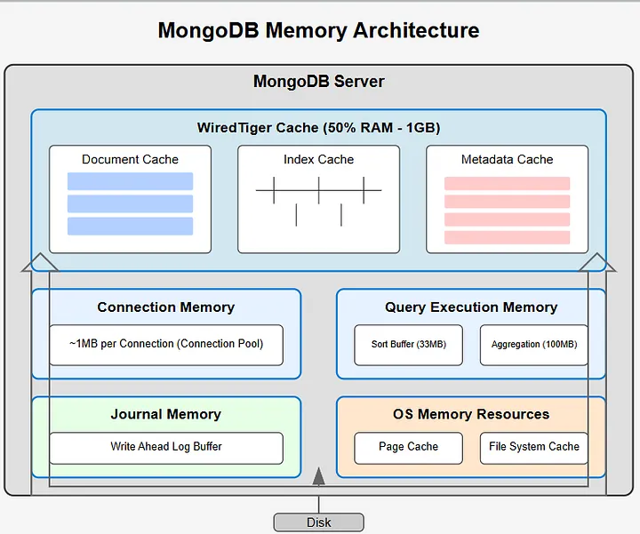

# 4.Storage Engine (WiredTiger)



## Storage Engine (WiredTiger)

This is the real data manager.

Inside WiredTiger, there are 3 major parts:

```
    ┌───────────────────────────┐
    │         mongod            │
    │  Query Engine             │
    │  ↓                        │
    │  WiredTiger               │
    │  ├── Cache (RAM)          │
    │  ├── Journal (WAL)        │
    │  └── Data Files           │
    └───────────────────────────┘
```

The WiredTiger storage engine reserves Defaults to 50% of RAM minus 1GB, which serves as MongoDB’s primary performance accelerator by keeping frequently accessed data in memory:

- **Document Cache**: Stores commonly accessed documents
- **Index Cache**: Maintains index structures for rapid lookups
- **Metadata Cache**: Holds collection schemas and query metadata

When a document isn’t found in cache, MongoDB retrieves it from disk, placing it in memory to speed up subsequent requests.

## **Query Execution Memory**

MongoDB allocates specific memory for query processing operations:

- **Sort Buffer (100MB per stage)**: Used for sorting operations. Exceeding this limit forces MongoDB to spill to disk, significantly reducing performance
- **Aggregation Memory (100MB)**: Holds intermediate results during aggregation pipeline operations. When this limit is exceeded, MongoDB uses temporary disk files

## **Journal Memory (Write-Ahead Log)**

To ensure data durability, MongoDB employs Write-Ahead Logging (WAL). Before persisting changes to the main data files:

1. Changes are first recorded in the journal buffer in memory
2. The journal is frequently flushed to disk
3. This mechanism enables recovery if the system crashes before changes reach permanent storage

### **Query Processing Flow**

When MongoDB processes a query:

1. The query arrives from a client connection
2. MongoDB checks the WiredTiger cache for the requested data
3. If found, data is served directly from memory (fast path)
4. If not found, data is loaded from disk into the cache (slow path)
5. For operations requiring sorting or aggregation, dedicated memory buffers are used
6. If memory limits are exceeded, MongoDB writes temporary data to disk
7. Write operations are journaled before being committed to the main data files
8. OS caching mechanisms assist with repeated disk operations